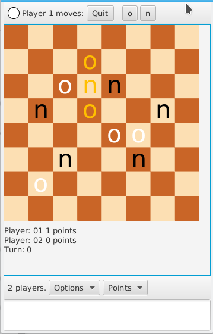

# JAVA-OSO

This is an implementation of the "SOS" game (In spain "OSO") in
Java/JavaFX made near 2017. It is extensible and can be used to implement
any other board game.

- The original name was "hrkono" (Somehow always I played this as "ONO").
- SOS/OSO wikipedia page [here](https://en.wikipedia.org/wiki/SOS_(game)).

### Changes in 2022

In 2017 it supported Android/Windows/Linux with "mobilefx" and Gradle. I used the
project to learn Java/Android development.

In 2022 tried to compile the Android APK but failed, "mobilefx" was long discontinued
and only worked with JVM8/Gradle59.

Because of that, I replaced gradle with maven and updated to "javafx-maven-plugin"
and removed everything related to Android (as it was specific to mobilefx).

### Ideas for PRs.

Make the Android APKs work again, publish on Google Play again, add more games.

### Prerequisites

- Maven.
- A recent (>11) JDK.

### Building and testing

You can compile with:

    mvn clean
    mvn compile

You can launch the program

    mvn javafx:run

### Collaborating

For making bug reports, feature requests and donations visit
one of the following links:

1. [gemini://harkadev.com/oss/](gemini://harkadev.com/oss/)
2. [https://harkadev.com/oss/](https://harkadev.com/oss/)

